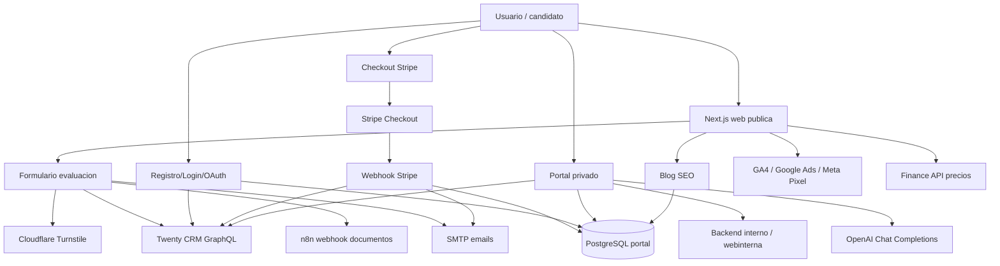

# Analisis tecnico completo del proyecto Growork

Documento creado para que otro agente de AI, editor tecnico o copywriter pueda entender el proyecto con suficiente profundidad como para escribir un articulo de portfolio preciso, atractivo y fiel a la realidad del producto.

## 1. Alcance del analisis

Este analisis cubre el proyecto local situado en:

`c:\Users\luisy\OneDrive\Escritorio\Agencia Suiza\26.WEb_publica`

Se han revisado:

- La documentacion de raiz (`ANALYTICS_*`, `PLAN_LEGAL_GROWORK.md`, `docs/*`, `SKILLS/*`).
- La aplicacion principal `growork-app/web`, construida con Next.js.
- Configuracion de build, seguridad, TypeScript, lint, PostCSS, Next y variables de entorno.
- Rutas publicas, rutas privadas, API routes, portal de cliente, blog, panel admin, scripts, datos semilla y assets publicos.
- Ficheros ocultos relevantes (`.env.example`, `.env.local`, `.gitignore`, `.node-version`, `.claude/*`) sin reproducir secretos.

No se documenta fichero por fichero el contenido de `node_modules`, `.git` ni `.next`, porque son dependencias/cache generadas. Su estado queda representado por `package-lock.json`, `package.json` y los artefactos de build/lint.

## 2. Resumen ejecutivo

Growork es una plataforma web comercial y operativa para ayudar a candidatos hispanohablantes a encontrar trabajo en Suiza. No es solo una landing: combina captacion de leads, evaluacion inicial, checkout, portal privado, integracion con CRM, sincronizacion con una web interna de operaciones, automatizaciones n8n, blog SEO y analitica de marketing.

La web esta orientada a convertir visitantes en candidatos o clientes de pago. El usuario puede:

- Informarse sobre trabajar en Suiza.
- Enviar una evaluacion con CV/carta y datos personales.
- Registrarse con email, Google o Facebook.
- Completar onboarding individual o en pareja.
- Comprar servicios puntuales o planes de acompanamiento.
- Acceder a un portal privado con candidaturas, respuestas de hoteles/empresas, estadisticas, documentos y chat con IA.

El proyecto se ha construido sobre un stack moderno:

- Next.js 16 con App Router.
- React 19.
- TypeScript estricto.
- Tailwind CSS 4.
- PostgreSQL mediante `postgres`.
- Stripe Checkout y webhooks.
- Twenty CRM por GraphQL.
- Backend interno `webinterna` para candidaturas, respuestas, documentos y metricas.
- OpenAI Chat Completions para asistente del portal.
- Cloudflare Turnstile, Cloudflare Access y Cloudflare como capa de seguridad/perimetro.
- Google Analytics 4, Google Ads y Meta Pixel.
- Nodemailer/SMTP para emails transaccionales.
- n8n para automatizar subida/procesado de documentos de leads.

## 3. Objetivo de negocio de la web

El objetivo principal de Growork es vender servicios de empleabilidad para Suiza y reducir la friccion de los candidatos durante todo el proceso.

El producto resuelve tres problemas:

1. Captacion y cualificacion: el formulario publico recoge datos, CV, carta, idiomas, disponibilidad y lugar de residencia. Permite tambien postulaciones en pareja.
2. Monetizacion: Stripe permite comprar productos puntuales y planes. El sistema distingue planes individuales/pareja, upsells y activacion diferida.
3. Seguimiento operativo: el portal muestra candidaturas enviadas, respuestas recibidas, rendimiento y documentos, tomando datos del backend interno y del CRM.

La web esta pensada para un portfolio como un proyecto integral de producto digital: frontend, backend, CRM, pagos, seguridad, analitica, SEO, automatizacion y operativa real.

## 4. Arquitectura general

### Capas principales

- **Capa publica**: home, blog, paginas legales, evaluacion, registro, login, compra, checkout y pagina de gracias.
- **Capa privada**: portal del candidato con dashboard, candidaturas, respuestas, estadisticas, plan, perfil, subida de CV/carta y chat.
- **Capa admin**: gestion de posts del blog y usuarios.
- **Capa API**: endpoints propios de Next.js para leads, auth, CRM, portal, Stripe, blog, crons y precios.
- **Capa de datos**: PostgreSQL propio para usuarios, pagos, productos, servicios, blog, tokens, rate limits y mensajes de chat.
- **Capa externa**: Stripe, Twenty, webinterna, n8n, OpenAI, Turnstile, OAuth, Analytics, SMTP y Finance.

## 5. Stack y herramientas

### Framework y runtime

- `next@16.2.1`: App Router, server components, route handlers, metadata, sitemap, robots, instrumentation.
- `react@19.2.4` y `react-dom@19.2.4`.
- Node requerido: `>=22.13.0`, reforzado por `.node-version` con `22`.
- TypeScript 5 con `strict: true`.
- Turbopack en build segun `build.txt`.

### UI y estilos

- Tailwind CSS 4 con `@tailwindcss/postcss`.
- CSS global propio en `src/app/globals.css`.
- Fuentes de Google via `next/font`: `Plus_Jakarta_Sans` e `Inter`.
- Iconos:
  - `lucide-react` en algunas piezas.
  - Componente propio `Icon.tsx`, basado en simbolos Material/Google-like mediante nombres.
- `chart.js` y `react-chartjs-2` para graficos del portal.

### Backend y datos

- PostgreSQL con la libreria `postgres`.
- Migraciones manuales ejecutadas al arranque desde `src/instrumentation.ts`.
- JWT de portal con `jose`.
- Hash de password con `bcryptjs`.
- Emails con `nodemailer`.

### Pagos

- `stripe@19.3.1`.
- Stripe Checkout para pagos.
- Stripe Webhook para aprovisionar usuarios, servicios, CRM y emails.

### Antispam y seguridad

- Cloudflare Turnstile en formulario publico.
- Rate limiting persistido en PostgreSQL.
- CSP y cabeceras de seguridad desde `next.config.ts`.
- Cookies HTTP-only para sesion.
- Validacion de origen en helpers CSRF.
- Validacion de PDF por MIME, tamano y magic bytes.

### Marketing y analitica

- Google Analytics 4.
- Google Ads.
- Meta Pixel.
- Consent Mode v2 con banner propio de cookies.
- Eventos ecommerce/client-side en `src/lib/analytics/track.ts`.

### Automatizacion y operaciones

- n8n para procesar documentos de leads.
- Twenty CRM como fuente CRM.
- Backend interno `webinterna` para candidaturas/respuestas/documentos.
- API de finanzas como fuente dinamica de precios.
- Cron jobs protegidos por API key.
- Documentacion operativa sobre VPS, seguridad, testing, parejas y sincronizacion.

## 6. Dependencias principales detectadas

Desde `growork-app/web/package.json`:

| Dependencia | Uso en el proyecto |
|---|---|
| `@marsidev/react-turnstile` | Widget Turnstile en formulario publico de evaluacion. |
| `@next/bundle-analyzer` | Analisis opcional del bundle con `ANALYZE=true`. |
| `@next/third-parties` | Integraciones de terceros de Next, aunque la carga de analytics esta implementada principalmente con componentes propios. |
| `bcryptjs` | Hash y verificacion de passwords. |
| `chart.js`, `react-chartjs-2` | Graficos del portal. |
| `country-codes-list` | Normalizacion/listado de paises en leads. |
| `dompurify` | Sanitizacion de contenido HTML si se requiere en renderizado. |
| `jose` | JWT de sesion del portal. |
| `lucide-react` | Iconografia React. |
| `nodemailer` | Emails transaccionales. |
| `postgres` | Cliente PostgreSQL. |
| `sharp` | Optimizacion de imagenes en scripts. |
| `stripe` | Checkout y webhooks. |

Scripts destacados:

- `npm run dev`: desarrollo local.
- `npm run build`: build de Next.
- `npm run analyze`: build con analizador de bundle.
- `npm run start`: arranque en produccion.
- `npm run lint`: lint.
- `npm run optimize:images`: optimizacion de assets publicos.
- `npm run blog:export`, `blog:upsert`, `blog:patch`: gestion de posts desde JSON/PostgreSQL.
- `npm run blog:enrich-seo`: enriquecimiento SEO de posts.
- `npm run seed:blogs`: seed de posts 2026.
- `npm run generate:provinces`: genera datos de provincias/paises.

Nota: `seed:blogs-part2` referencia `scripts/seed_blogs_part2_2026.ts`, pero ese fichero no existe en el arbol actual.

## 7. Configuracion de Next.js

`growork-app/web/next.config.ts` define:

- Bundle analyzer condicional.
- `poweredByHeader: false`.
- `experimental.inlineCss: true`.
- Imagenes AVIF/WebP con calidades permitidas.
- `remotePatterns` para `images.unsplash.com`.
- Cabeceras de cache para assets estaticos.
- CSP estricta con permisos explicitos para:
  - Stripe.
  - Cloudflare Turnstile.
  - Calendly.
  - Google Analytics / Google Ads / DoubleClick.
  - Meta/Facebook Pixel.
  - Cloudflare Insights.
  - Google Fonts.
  - Unsplash.
- Cabeceras:
  - `X-Frame-Options: DENY`.
  - `X-Content-Type-Options: nosniff`.
  - `Referrer-Policy`.
  - `Permissions-Policy`.
  - HSTS.
- Redireccion de `www.growork.es` a `growork.es`.
- Redirecciones SEO de slugs antiguos/faltantes hacia `/blog/trabajos-en-suiza`.

## 8. Variables de entorno y servicios externos

El proyecto usa `.env.example` como plantilla y `.env.local` como fichero local sensible. No se deben publicar valores reales.

### Variables detectadas en codigo y plantillas

| Variable | Uso |
|---|---|
| `PORTAL_DB_URL` | Conexion PostgreSQL del portal. |
| `PORTAL_DB_SSL` | Configuracion SSL opcional de PostgreSQL. |
| `PORTAL_JWT_SECRET` | Firma de sesiones JWT. |
| `SMTP_HOST`, `SMTP_PORT`, `SMTP_USER`, `SMTP_PASS` | Envio de emails transaccionales. |
| `STRIPE_SECRET_KEY` | Stripe server-side. |
| `STRIPE_WEBHOOK_SECRET` | Verificacion de webhooks Stripe. |
| `NEXT_PUBLIC_STRIPE_PUBLISHABLE_KEY` | Stripe client-side si se necesita publicar. |
| `TWENTY_API_KEY` | API key de Twenty CRM. |
| `CF_ACCESS_CLIENT_ID`, `CF_ACCESS_CLIENT_SECRET` | Acceso Cloudflare hacia Twenty/protegidos. |
| `GOOGLE_CLIENT_ID`, `GOOGLE_CLIENT_SECRET` | OAuth Google. |
| `FACEBOOK_CLIENT_ID`, `FACEBOOK_CLIENT_SECRET` | OAuth Facebook. |
| `BACKEND_URL` | API del backend interno/webinterna. |
| `API_KEY` | API key compartida para backend interno y endpoints protegidos. |
| `FINANCE_URL`, `FINANCE_API_KEY` | API de finanzas para precios. |
| `FINANCE_CF_ACCESS_CLIENT_ID`, `FINANCE_CF_ACCESS_CLIENT_SECRET` | Cloudflare Access para Finance. |
| `NEXT_PUBLIC_SITE_URL` | URL publica canonica. |
| `ALLOW_LOCALHOST_SITE_URL` | Permite localhost como site URL en casos controlados. |
| `NEXT_PUBLIC_SCHEDULER_URL` | URL Calendly/agenda. |
| `NEXT_PUBLIC_SCHEDULER_PHONE_URL` | Variante de agenda telefonica si esta definida. |
| `NEXT_PUBLIC_TURNSTILE_SITE_KEY`, `TURNSTILE_SECRET_KEY` | Cloudflare Turnstile. |
| `N8N_LEADS_WEBHOOK_URL`, `N8N_LEADS_WEBHOOK_SECRET`, `N8N_COUPLE_DELAY_MS` | Automatizacion n8n para documentos de leads. |
| `OPENAI_API_KEY`, `OPENAI_MODEL`, `OPENAI_MAX_TOKENS` | Chat IA del portal. |
| `NEXT_PUBLIC_GA_ID` | Google Analytics 4. |
| `NEXT_PUBLIC_GOOGLE_ADS_ID` | Google Ads. |
| `NEXT_PUBLIC_META_PIXEL_ID` | Meta Pixel. |
| `META_CAPI_ACCESS_TOKEN`, `META_CAPI_TEST_EVENT_CODE` | Preparacion para Meta CAPI server-side. |
| `NEXT_PUBLIC_ADVISOR_WHATSAPP`, `NEXT_PUBLIC_ADVISOR_EMAIL` | Datos del asesor visible en portal. |

### Integraciones externas reales

- **Twenty CRM**: GraphQL en `https://crm.growork.es/graphql`.
- **Stripe**: Checkout, PaymentIntent, webhooks y coupons de upsell.
- **Webinterna/backend interno**: API privada para candidaturas, respuestas, documentos y estadisticas.
- **Finance API**: fuente dinamica de precios.
- **OpenAI**: Chat Completions para asistente privado del portal.
- **Cloudflare Turnstile**: proteccion del formulario publico.
- **Cloudflare Access**: service tokens para servicios internos protegidos.
- **n8n**: webhook de subida/procesado de documentos.
- **Google OAuth** y **Facebook OAuth**: registro/login social.
- **GA4, Google Ads, Meta Pixel**: analitica y conversiones.
- **Calendly**: agenda de llamadas.
- **SMTP/Zoho-like**: emails transaccionales.

## 9. Rutas publicas y paginas principales

### Home `/`

Archivo principal: `growork-app/web/src/app/page.tsx`.

La home es una landing completa con:

- Hero principal orientado a trabajar en Suiza.
- KPIs.
- Seccion de servicios.
- Formulario de evaluacion embebido.
- Planes y precios.
- Testimonios.
- Teaser del blog.
- Contacto por WhatsApp, email y agenda.
- Footer legal.
- JSON-LD de organizacion/servicio profesional.

Componentes clave:

- `NavHome.tsx`.
- `KpiSection.tsx`.
- `EvaluationForm.tsx`.
- `PlansSection.tsx`.
- `PlanCTAButton.tsx`.
- `WhatsAppButton.tsx`.
- `CookieBannerClient.tsx`.
- `ScrollRevealClient.tsx`.

### Evaluacion publica

`EvaluationForm.tsx` es una de las piezas comerciales mas importantes.

Capacidades:

- Modo individual y modo pareja.
- Datos personales, telefono, pais, provincia, postal, idiomas, disponibilidad.
- Subida de CV y carta en PDF.
- Turnstile cargado de forma diferida con IntersectionObserver.
- Validacion de emails distintos en pareja.
- Envio como `FormData` a `/api/leads/submit`.
- Campos prefijados `personA_*` y `personB_*` para parejas.

### Registro `/registro`

Permite:

- Crear cuenta con email/password.
- OAuth Google.
- OAuth Facebook.
- Tracking `sign_up`.
- Redireccion a onboarding.

Endpoint principal: `/api/auth/register`.

### Login `/login`

Permite:

- Login con email/password.
- Login con Google/Facebook.
- Tracking `login`.
- Redireccion inteligente a onboarding, admin o portal.

Endpoint principal: `/api/portal/auth/login`.

### Onboarding `/onboarding`

Formulario privado de completado de datos.

Flujos:

- Individual: envia datos a `/api/crm/update-lead`.
- Pareja: envia datos a `/api/crm/upsert-couple-leads`.
- Usuario guest comprado: puede configurar password via `/api/portal/auth/setup-account`.
- Carga datos previos desde `/api/portal/onboarding-data` y `/api/portal/me`.

El onboarding resuelve duplicados por telefono, sincroniza Twenty y actualiza `portal_users`.

### Contratacion autenticada `/contratar/[plan]`

Archivos:

- `src/app/contratar/[plan]/page.tsx`.
- `CheckoutForm.tsx`.
- `UpsellPopup.tsx`.

Pensada para usuarios logueados y con onboarding. Llama a `/api/stripe/create-checkout`.

Incluye:

- Plan seleccionado.
- Precio dinamico/fallback.
- Soporte individual/pareja segun `account_type`.
- Credito upsell si el cliente compro antes un producto puntual.
- Tracking `begin_checkout`.

### Compra guest `/comprar/[plan]`

Archivos:

- `src/app/comprar/[plan]/page.tsx`.
- `GuestCheckoutForm.tsx`.

Permite compra publica de planes sin cuenta previa. Despues el webhook crea usuario y envia setup.

### Pago completado `/pago/gracias`

Lee `session_id` de Stripe, recupera datos de la sesion y muestra mensaje de exito.

`PurchaseTracker.tsx` lanza evento `purchase` client-side con transaction id, valor, moneda e item.

### Agenda `/agendar-llamada`

Pagina de agenda con Calendly y tracking especifico mediante `CalendlyTracker.tsx`.

### Passwords

- `/recuperar`: solicita email de recuperacion.
- `/nueva-password`: aplica token de reset.
- `/actualizar-password`: cambio de password desde sesion activa.

### Legales

- `/privacidad`.
- `/terminos`.
- `/aviso-legal`.
- `/cookies`.

Todas usan `LegalLayout.tsx` y estan alineadas con `PLAN_LEGAL_GROWORK.md`.

## 10. Portal privado

El portal vive bajo `/portal/*`.

Proteccion:

- `src/proxy.ts` redirige usuarios no autenticados a `/login?next=...`.
- `src/app/portal/layout.tsx` redirige leads sin onboarding a `/onboarding`.
- Admin se comprueba tambien en handlers mediante DB.

Shell:

- `PortalShell.tsx`: layout general.
- `Sidebar.tsx`: navegacion.
- `Topbar.tsx`: barra superior.
- `WelcomeModal.tsx`: modal inicial.
- `UnreadPoller.tsx`: contador de respuestas.
- `ChatWidget.tsx`: asistente IA.
- `PlanPaywall.tsx`: bloqueo de vistas si no hay plan activo.

### Secciones del portal

| Ruta | Proposito |
|---|---|
| `/portal/dashboard` | Panorama general, metricas, estado del plan y actividad. |
| `/portal/candidaturas` | Lista de candidaturas enviadas por la web interna. |
| `/portal/candidaturas/[id]` | Redireccion/compatibilidad; el detalle se maneja con modal/API. |
| `/portal/respuestas` | Bandeja de respuestas de empresas/hoteles. |
| `/portal/respuestas/[id]` | Redireccion/compatibilidad. |
| `/portal/estadisticas` | Rendimiento con graficos. |
| `/portal/mi-plan` | Plan activo, historial, renovacion y productos disponibles. |
| `/portal/perfil` | Datos personales, documentos, CV/carta y pareja. |

### Fuente de datos del portal

El portal mezcla:

- PostgreSQL local: sesion, usuario, servicios, pagos, flags.
- Twenty CRM: perfil, Cliente/Person, pareja, plan.
- Backend interno/webinterna: candidaturas, respuestas, adjuntos, documentos, stats.

Helpers centrales:

- `getShellProps.ts`: obtiene datos comunes del shell.
- `getLinkedClient.ts`: resuelve cliente vinculado.
- `getPlanStatus.ts`: determina si hay plan activo.
- `planActivation.ts`: activa plan cuando aparece el primer envio real.
- `mappers.ts`: transforma DTOs de backend en modelos UI.
- `backendFetch.ts`: proxy server-side hacia webinterna con API key.

## 11. Logica de planes y precios

Catalogo cliente: `src/lib/plans.ts`.

Productos puntuales:

- `carta`: carta de motivacion.
- `cv`: CV adaptado.
- `cv-carta`: pack CV + carta.

Planes:

- `growork-experience`.
- `growork-starter`.
- `growork-professional`.
- `growork-elite`.

Cada plan tiene:

- Precio individual.
- Precio pareja.
- Duracion en dias.
- Precio original para descuento visual.
- CTA.
- Codigo equivalente para Twenty CRM.

Precios dinamicos:

- `src/lib/finance-prices.ts` consulta la API de finanzas.
- `/api/plans-prices` reexpone precios al navegador sin exponer credenciales.
- Cache CDN: `s-maxage=300, stale-while-revalidate=60`.
- Si Finance falla, se usan precios hardcoded.

Observacion importante: existen posibles desalineaciones entre `plans.ts`, seed de `products` en `db.ts` y `public/llms.txt`. Para portfolio se puede explicar como deuda tecnica normal de producto en evolucion.

## 12. Flujo de lead publico

Endpoint: `src/app/api/leads/submit/route.ts`.

Pasos:

1. Recibe `FormData` desde `EvaluationForm`.
2. Aplica rate limit por IP.
3. Verifica Cloudflare Turnstile.
4. Valida campos y PDFs.
5. Si es individual:
   - Crea lead en Twenty.
   - Actualiza perfil, direccion, idiomas, disponibilidad y campos comerciales.
   - Envia documentos a n8n.
   - Envia email de confirmacion.
6. Si es pareja:
   - Valida dos personas y emails distintos.
   - Crea dos leads.
   - Vincula pareja en Twenty.
   - Actualiza ambos perfiles.
   - Lanza webhook n8n para cada persona, con delay configurable.
   - Envia confirmaciones.

Este flujo es clave porque conecta marketing, CRM, documentos y automatizacion.

## 13. Flujo de registro y autenticacion

### Registro email/password

Endpoint: `/api/auth/register`.

- Rate limit.
- Crea lead en Twenty con fuente web.
- Hashea password con bcrypt.
- Inserta `portal_users`.
- Crea cookie JWT.

### OAuth Google/Facebook

Rutas:

- `/api/auth/oauth/google`.
- `/api/auth/oauth/google/callback`.
- `/api/auth/oauth/facebook`.
- `/api/auth/oauth/facebook/callback`.

El flujo usa estado OAuth, cookies temporales y crea/actualiza usuario portal. Google exige email verificado; Facebook puede fallar si no devuelve email.

### Login

Endpoint: `/api/portal/auth/login`.

- Rate limit por IP.
- Comparacion bcrypt.
- Bloqueo tras multiples fallos.
- Mensajes genericos para reducir enumeracion.
- Sesion JWT con cookie HTTP-only.

### Reset/setup/cambio password

Endpoints:

- `/api/portal/auth/forgot-password`.
- `/api/portal/auth/reset-password`.
- `/api/portal/auth/setup-account`.
- `/api/portal/auth/change-password`.
- `/api/portal/auth/logout`.
- `/api/portal/auth/me`.
- `/api/portal/auth/refresh`.

Los tokens se guardan en `password_reset_tokens` como hash SHA-256, son de un solo uso y caducan.

## 14. Flujo de pago y aprovisionamiento

### Checkout autenticado

Endpoint: `/api/stripe/create-checkout`.

Responsabilidades:

- Exige usuario autenticado.
- Exige onboarding completo.
- Aplica rate limit.
- Comprueba que el tipo de cuenta coincide con precio individual/pareja.
- Obtiene precio dinamico desde Finance o fallback.
- Aplica credito upsell si procede.
- Crea sesion Stripe Checkout.
- Inserta/actualiza pago pendiente en PostgreSQL.

### Checkout guest

Endpoint: `/api/stripe/create-checkout-guest`.

Responsabilidades:

- Permite compra publica de planes.
- No permite oneoffs.
- Valida email, nombre y datos de pareja si aplica.
- Marca metadata `guest_checkout=true`.
- El usuario se crea despues desde webhook.

### Webhook Stripe

Endpoint: `/api/stripe/webhook`.

Responsabilidades principales:

1. Verifica firma con `STRIPE_WEBHOOK_SECRET`.
2. Gestiona `checkout.session.completed` y `checkout.session.expired`.
3. Actualiza tabla `payments`.
4. Crea/actualiza Person en Twenty con estado PAGADO.
5. Para planes, marca campos de plan en Twenty.
6. En parejas, crea/actualiza partner y vincula pareja.
7. Crea usuario del portal via endpoint interno `/api/portal/admin/create-user`.
8. Inserta `client_services`.
9. Resuelve el Cliente real de Twenty cuando el workflow interno ya lo ha creado.
10. Actualiza `portal_users.client_id` de Person UUID a Cliente UUID.
11. Envia emails de bienvenida, setup o confirmacion de oneoff.
12. Consume creditos upsell y marca idempotencia.

Detalle de negocio importante: los planes tienen **activacion diferida**. El reloj de un plan no empieza al pagar, sino cuando aparece el primer envio real/candidatura. Esto se implementa con `client_services.activated_at`, `started_at`, `expires_at` y `planActivation.ts`.

## 15. Integracion con Twenty CRM

Archivo central: `src/lib/twenty.ts`.

El proyecto maneja dos conceptos de Twenty:

- `Person`: contacto/lead inicial.
- `Cliente`: entidad post-pago creada por workflows/operativa.

Funciones destacadas:

- Crear lead.
- Actualizar lead.
- Crear cliente.
- Actualizar cliente.
- Resolver duplicados por telefono.
- Anadir email adicional.
- Soft-delete de persona duplicada.
- Vincular parejas.
- Actualizar campos de plan.
- Resolver Cliente desde Person.
- Introspeccion de schema para actualizaciones de Cliente.

Campos relevantes:

- Estado del lead.
- Fuente.
- Plan activo.
- Estado del plan.
- Fechas de inicio/expiracion.
- Relacion de pareja (`campoPareja`).

La integracion esta disenada para convivir con workflows externos que transforman leads/personas en clientes.

## 16. Integracion con webinterna/backend interno

Helpers:

- `src/lib/portal/backendFetch.ts`.
- `src/lib/portal/mappers.ts`.

Endpoints consumidos por el portal:

- Clientes.
- Candidaturas/enviados.
- Respuestas.
- Adjuntos.
- Estadisticas.
- Jobs.
- CV/carta status y uploads.
- Envio de respuesta.
- Sugerencia de respuesta.

La web publica no implementa el motor operativo de candidaturas: lo consume desde un backend interno protegido con `API_KEY`.

La documentacion `docs/SYNC_WEBINTERNA_FINANZAS.md` explica en detalle la sincronizacion entre pagos, portal, CRM, finanzas y webinterna.

## 17. Chat IA del portal

Endpoint: `/api/portal/chat`.

Componentes:

- UI: `ChatWidget.tsx`.
- Prompt/contexto: `chatContext.ts`.
- Sanitizador: `chatSanitizer.ts`.
- Rate limits: `chatRateLimit.ts`.
- Log: `chat_messages` en PostgreSQL.

Flujo:

1. Verifica sesion.
2. Aplica rate limits por usuario/hora/dia/mes.
3. Sanitiza prompt para bloquear intentos de prompt injection.
4. Construye contexto del cliente desde datos internos.
5. Llama a OpenAI Chat Completions.
6. Rechaza respuestas que parezcan filtrar prompt/sistema.
7. Registra mensajes y bloqueos.

El asistente esta limitado a temas de Growork y empleo en Suiza, usando los datos del cliente disponibles.

## 18. Blog, SEO y contenido

El blog es dinamico sobre PostgreSQL.

Archivos:

- `src/lib/db/blog.ts`.
- `src/app/blog/page.tsx`.
- `src/app/blog/[slug]/page.tsx`.
- `src/app/blog/trabajos-en-suiza/page.tsx`.
- `src/app/blog/trabajos-en-suiza/[slug]/page.tsx`.

Caracteristicas:

- Posts normales y posts cluster.
- JSONB para cuerpo, FAQs, breadcrumbs, next steps y related slugs.
- Metadata dinamica.
- JSON-LD Article/Breadcrumb/FAQ/HowTo segun caso.
- Imagenes por slug en `public/images/blog`.
- Pagina hub SEO para "Trabajos en Suiza 2026".
- Slugs cluster para temas de alto valor SEO.

APIs:

- `/api/blog/all`.
- `/api/blog/featured`.

Admin blog:

- `/admin/blogs`.
- `/admin/blogs/new`.
- `/admin/blogs/[slug]`.
- `/api/admin/blogs`.
- `/api/admin/blogs/[slug]`.

El editor `BlogEditor.tsx` permite editar metadata, keywords y bloques JSON. Los handlers limitan tamano de strings y arrays para reducir riesgo DoS.

## 19. Sitemap, robots y llms.txt

### `src/app/sitemap.ts`

Sitemap dinamico con:

- Home.
- Blog.
- Hub de trabajos en Suiza.
- Agenda.
- Landings comerciales.
- Posts cluster desde DB.
- Posts normales desde DB.
- Paginas legales.

`dynamic = 'force-dynamic'` y `revalidate = 0`.

### `src/app/robots.ts`

Permite indexacion general y bloquea:

- `/admin/`.
- `/dashboard/`.
- `/portal/`.
- `/api/`.
- `/auth/`.

Sitemap canonico: `https://growork.es/sitemap.xml`.

### `public/llms.txt`

Documento para LLMs con descripcion del negocio, servicios, precios, enlaces y objetivo. Contiene informacion comercial util, aunque conviene revisarlo si cambian precios.

## 20. Analitica y consentimiento

Archivos:

- `src/components/GoogleAnalyticsLoader.tsx`.
- `src/components/MetaPixelLoader.tsx`.
- `src/components/CookieBanner.tsx`.
- `src/components/CookieBannerClient.tsx`.
- `src/lib/analytics/track.ts`.
- `ANALYTICS_PLAN.md`.
- `ANALYTICS_ESTADO.md`.

Funcionamiento:

- Consent Mode v2 se inicializa en `layout.tsx` con consentimiento denegado por defecto.
- El banner guarda consentimiento en localStorage.
- GA4 se carga si `NEXT_PUBLIC_GA_ID` existe.
- Google Ads se configura si `NEXT_PUBLIC_GOOGLE_ADS_ID` existe.
- Meta Pixel se carga si `NEXT_PUBLIC_META_PIXEL_ID` existe.
- `track.ts` centraliza eventos:
  - `generate_lead`.
  - `begin_checkout`.
  - `purchase`.
  - `sign_up`.
  - `login`.
  - eventos de archivo, outbound/share y clicks relevantes.

La documentacion de analitica muestra un plan profesional de medicion, conversiones, debug y pasos pendientes.

## 21. Base de datos propia

Archivo: `src/lib/portal/db.ts`.

Se ejecutan migraciones al arrancar mediante `src/instrumentation.ts`.

Tablas principales:

| Tabla | Proposito |
|---|---|
| `portal_users` | Usuarios del portal, auth, rol, OAuth, onboarding, pareja, cliente CRM. |
| `payments` | Sesiones Stripe, estado de pago, plan, amount, guest/couple, upsell. |
| `products` | Catalogo interno de productos/planes. |
| `client_services` | Servicios comprados/activos, activacion diferida, expiracion. |
| `blog_posts` | Posts normales y cluster, metadata SEO y cuerpo JSONB. |
| `password_reset_tokens` | Tokens hash para reset/setup. |
| `rate_limit_log` | Persistencia de rate limits. |
| `chat_messages` | Auditoria del chat IA. |

Detalles importantes:

- `portal_users.client_id` puede empezar como Person UUID y luego migrar a Cliente UUID.
- `client_services` distingue servicios partner mediante `is_partner_service`.
- `payments` soporta recordatorios upsell y descuento aplicado.
- `products` se seed-ea desde codigo, pero puede estar desalineado con precios actuales si no se sincroniza con Finance.

## 22. Seguridad

Piezas de seguridad detectadas:

- CSP fuerte en `next.config.ts`.
- `frame-ancestors 'none'` y `X-Frame-Options: DENY`.
- `nosniff`, HSTS, Referrer Policy y Permissions Policy.
- Cookies de sesion HTTP-only, secure en produccion, SameSite Lax.
- JWT firmado con secreto propio.
- Passwords con bcrypt.
- Tokens de reset/setup hasheados y de un solo uso.
- Rate limits en login, registro, leads, checkout, respuestas y chat.
- API key con comparacion constante en `apiKey.ts`.
- Turnstile para formulario publico.
- Validacion de PDF por tamano/tipo/magic bytes.
- Sanitizacion de nombres de archivo PDF.
- Proxy de rutas privadas antes de renderizar.
- Robots bloquea portal/admin/api.
- Documentacion operativa de VPS, UFW, Cloudflare, Traefik y rotacion de secretos en `SKILLS/SEGURIDAD.md`.

Riesgo a cuidar: existen ficheros locales sensibles (`.env.local`, `.claude/settings.local.json`) y un script de diagnostico con conexion hardcodeada. No deben publicarse ni copiarse a portfolio.

## 23. Cron jobs

### `/api/cron/expiry`

Protegido por `x-api-key`.

Responsabilidades:

- Marca servicios activos como expirados si `expires_at < NOW()`.
- Actualiza Twenty con `planStatus=EXPIRED`.
- Envia avisos de renovacion 3 dias antes de expirar.
- Envia resumen al admin.

### `/api/cron/upsell-reminder`

Protegido por `x-api-key`.

Responsabilidades:

- Busca compradores de oneoff sin plan activo.
- Envia recordatorio para usar el credito como descuento.
- Marca `upsell_reminder_sent_at`.
- Envia resumen admin.

## 24. Diseno visual y UX

El diseno mezcla landing comercial con herramienta privada.

### Publico

- Estetica premium/profesional.
- Colores de marca alrededor de rojo Growork, slate profundo, blanco alpino y acentos verdes/azules.
- Hero visual con `hero-bg.jpg`.
- Secciones con CTA claros.
- Formulario extenso pero guiado.
- Blog orientado a SEO y confianza.

### Portal

- Layout tipo SaaS/dashboard.
- Sidebar persistente en desktop y drawer en mobile.
- Topbar con busqueda visual, notificaciones y perfil.
- Cards de metricas.
- Tablas/listados para candidaturas y respuestas.
- Paywall suave si no hay plan.
- Chat flotante.
- Modal de bienvenida.

`globals.css` contiene gran parte del sistema visual del portal: grid, topbar, sidebar, glass panels, responsive candidaturas/respuestas, chat y utilidades.

## 25. Estado actual de build, lint y calidad

Artefactos encontrados:

- `build.txt`: build de Next 16.2.1 completado correctamente con Turbopack.
- `lint.txt`: contiene errores y warnings pendientes.

Errores de lint destacados:

- Comillas sin escapar en `src/app/blog/trabajos-en-suiza/page.tsx`.
- Uso de `any` en `src/app/page.tsx`.
- Uso de links `<a>` internos donde Next recomienda `Link`.
- Uso de `any` en `src/lib/db/blog.ts`.

Warnings:

- Uso de `` en varias zonas donde Next recomienda `next/image`.
- Componente/import no usado.
- Warning de fuente custom en layout.

No se ha detectado una suite de tests automatizados en el arbol actual. Hay documentacion de testing manual en `SKILLS/TESTING-FLUJO-CONTRATACION.md`.

## 26. Deuda tecnica y puntos a vigilar

1. **Secrets en local**: `.env.local`, `.claude/settings.local.json` y algunos scripts contienen valores sensibles o referencias privadas. Sanitizar antes de compartir.
2. **Script ausente**: `seed:blogs-part2` apunta a `scripts/seed_blogs_part2_2026.ts`, no presente.
3. **Precios duplicados**: `plans.ts`, seed de `products`, `llms.txt` y Finance pueden no coincidir.
4. **Lockfiles**: existen `package-lock.json` y `growork-app/yarn.lock`; el lockfile real de la app parece ser npm.
5. **Artefactos versionables**: `build.txt`, `lint.txt`, `tsconfig.tsbuildinfo`, `next-env.d.ts`, `/data` y `/scripts` estan ignorados por `.gitignore` pero existen localmente.
6. **Assets por revisar**: SVGs default de Next y algunos assets antiguos estan marcados como no referenciados en `.gitignore`.
7. **Lint pendiente**: conviene limpiar errores antes de usar el proyecto como pieza principal de portfolio tecnico.
8. **Codificacion en consola**: algunos outputs aparecen con mojibake al leerlos desde PowerShell, probablemente por encoding de terminal. Revisar visualmente antes de publicar textos.

## 27. Inventario de archivos y proposito

### Raiz del workspace

| Archivo | Proposito |
|---|---|
| `.claude/settings.json` | Configuracion local de permisos/herramientas Claude. |
| `.claude/settings.local.json` | Configuracion local sensible con comandos/secretos; no publicar sin sanitizar. |
| `ANALYTICS_ESTADO.md` | Estado/debug de analitica, GA4 y CSP. |
| `ANALYTICS_PLAN.md` | Plan detallado de analitica, conversiones, Ads, Meta y medicion. |
| `PLAN_LEGAL_GROWORK.md` | Plan legal para privacidad, cookies, terminos, RGPD y venta de servicios. |
| `deep-research-report (1).md` | Investigacion sobre `llms.txt` y optimizacion para LLMs. |
| `cambios.md` | Documento placeholder/cambios. |
| `docs/SYNC_WEBINTERNA_FINANZAS.md` | Documento extenso de sincronizacion entre finanzas, webinterna, CRM y portal. |
| `docs/VERIFICACION_SYNC.md` | Checklist/verificacion de sincronizacion. |
| `SKILLS/CHAT-BOT.md` | Guia interna del chat/AI assistant. |
| `SKILLS/DESIGN.md` | Guia de diseno del proyecto. |
| `SKILLS/PAREJAS.md` | Guia del flujo de parejas. |
| `SKILLS/SEGURIDAD.md` | Guia de hardening, VPS, Cloudflare, firewall y secretos. |
| `SKILLS/TESTING-FLUJO-CONTRATACION.md` | Checklist de QA para contratacion, Stripe, portal y CRM. |
| `SKILLS/VPS-ACCESO-Y-SEGURIDAD.md` | Acceso/seguridad de VPS, Dokploy, UFW, fail2ban y contenedores. |

### `growork-app`

| Archivo/directorio | Proposito |
|---|---|
| `growork-app/FOTOS-VLOGS.md` | Notas sobre imagenes/fotos para vlogs o contenido. |
| `growork-app/yarn.lock` | Lockfile Yarn minimo; la app principal usa tambien npm lock. |
| `growork-app/packages/app/features/home/` | Estructura de paquetes/features actualmente sin archivos. |

### Configuracion de `growork-app/web`

| Archivo | Proposito |
|---|---|
| `.env.example` | Plantilla de variables de entorno. |
| `.env.local` | Variables locales reales; sensible, no publicar valores. |
| `.gitignore` | Ignora dependencias, build, env, scripts/datos locales y assets no usados. |
| `.node-version` | Version Node `22`. |
| `AGENTS.md` | Nota para agentes sobre version de Next y docs locales. |
| `CLAUDE.md` | Referencia a `AGENTS.md`. |
| `README.md` | Boilerplate de create-next-app. |
| `package.json` | Dependencias, scripts y version de Node. |
| `package-lock.json` | Lockfile npm real de la app. |
| `next.config.ts` | Configuracion Next, CSP, headers, imagenes, redirects y analyzer. |
| `tsconfig.json` | TypeScript estricto, alias `@/*`, bundler mode. |
| `next-env.d.ts` | Tipos generados de Next. |
| `tsconfig.tsbuildinfo` | Cache incremental TypeScript. |
| `eslint.config.mjs` | Config ESLint Next + TypeScript. |
| `postcss.config.mjs` | Plugin Tailwind para PostCSS. |
| `build.txt` | Salida de build exitoso. |
| `lint.txt` | Salida de lint con errores/warnings pendientes. |

### Datos y scripts

| Archivo | Proposito |
|---|---|
| `data/blog-updates/batch-02-5-blogs.json` | 5 posts SEO: seguro medico, impuestos, salarios, CV suizo, cocina/hosteleria. |
| `data/blog-updates/batch-03-5-blogs.json` | 5 posts SEO: homologacion, sanidad, pensiones, derechos, alojamiento. |
| `data/blog-updates/batch-04-5-blogs.json` | 5 posts SEO: IT, construccion, entrevista, salario, coste de vida. |
| `data/blog-updates/batch-05-5-blogs.json` | 5 posts SEO: profesiones, networking, busqueda desde Espana, sin idiomas, temporarbyro. |
| `data/blog-updates/permisos-trabajo-suiza-2026.json` | Post SEO especifico de permisos de trabajo. |
| `scripts/blog-export.ts` | Exporta posts desde PostgreSQL a JSON. |
| `scripts/blog-upsert.ts` | Inserta/actualiza posts desde JSON, con dry run. |
| `scripts/blog-patch.ts` | Parchea posts existentes desde JSON. |
| `scripts/enrich_blog_seo_2026.ts` | Enriquece posts con SEO, FAQs, fuentes y copy. |
| `scripts/seed_blogs_2026.ts` | Seed masivo de posts 2026. |
| `scripts/generate-country-provinces.mjs` | Genera datos de paises/provincias. |
| `scripts/copy_images.cjs` | Copia imagenes generadas al directorio publico del blog. |
| `scripts/find_missing_images.cjs` | Diagnostica imagenes faltantes contra DB; revisar porque contiene datos sensibles. |
| `scripts/optimize-public-images.mjs` | Optimiza imagenes publicas con Sharp. |

### Assets publicos

| Archivo | Proposito |
|---|---|
| `public/favicon.svg` | Favicon. |
| `public/logo.png` | Logo raster. |
| `public/logo_svg.svg` | Logo vectorial. |
| `public/hero-bg.jpg` | Imagen principal hero. |
| `public/fondo-review.png` | Fondo/seccion reviews. |
| `public/fondo-formulario-new.png` | Fondo formulario. |
| `public/contactanos.jpg` | Imagen contacto desktop. |
| `public/contactanos-movil.jpg` | Imagen contacto mobile. |
| `public/bot.png` | Imagen/avatar bot. |
| `public/llms.txt` | Descriptor del sitio para LLMs. |
| `public/file.svg`, `globe.svg`, `next.svg`, `vercel.svg`, `window.svg` | SVGs default/no referenciados segun `.gitignore`. |
| `public/images/welcome-optimized.jpg` | Imagen onboarding/bienvenida. |
| `public/images/portal_hero_bg.png` | Fondo visual portal. |
| `public/images/login-bg-optimized.jpg` | Fondo login. |
| `public/images/foto-luis.jpeg` | Foto autor/equipo Luis. |
| `public/images/foto-javi.jpeg` | Foto autor/equipo Javi. |

Imagenes de blog en `public/images/blog`:

- `10-curiosidades-de-suiza-antes-de-mudarte.png`.
- `alojamiento-temporal-primeros-meses-suiza-2026.png`.
- `aprender-aleman-para-trabajar-en-suiza.png`.
- `buscar-desde-espana-o-suiza.png`.
- `carta-motivacion-suiza-2026.png`.
- `como-trabajar-en-suiza-siendo-espanol-guia-2025.png`.
- `coste-vida-busqueda-empleo-suiza.png`.
- `cv-formato-suizo-2026.png`.
- `cv-formato-suizo-como-hacer-curriculum-suiza.png`.
- `derechos-laborales-suiza-despidos-vacaciones-2026.png`.
- `empleo-sin-idiomas-suiza-2026.png`.
- `entrevista-trabajo-suiza-preguntas-2026.png`.
- `errores-comunes-buscar-trabajo-en-suiza.png`.
- `homologar-titulo-universitario-suiza-sefri.png`.
- `hosteleria-en-suiza-hoteles-lujo-temporadas-primer-trabajo.png`.
- `impuestos-suiza-espanoles-2026.png`.
- `negociar-salario-suiza-bruto-neto.png`.
- `networking-linkedin-suiza.png`.
- `permisos-de-trabajo-en-suiza-para-espanoles.png`.
- `permisos-trabajo-suiza-2026.png`.
- `portales-de-empleo-suiza-2026.png`.
- `profesiones-mas-demandadas-suiza-2026.png`.
- `salarios-en-suiza-2025-hosteleria-construccion-servicios.png`.
- `seguro-medico-suiza-krankenkasse-2026.png`.
- `sistema-pensiones-suiza-3-pilares-2026.png`.
- `temporarbyro-suiza-2026.png`.
- `trabajar-cocina-hosteleria-suiza-2026.png`.
- `trabajar-construccion-oficios-suiza-2026.png`.
- `trabajar-it-tecnologia-suiza-salarios-2026.png`.
- `trabajar-sanidad-suiza-enfermeria-medicina-2026.png`.
- `trabajos-mas-demandados-suiza-hispanohablantes.png`.
- `vivir-en-suiza-coste-de-vida-alquileres-realidad.png`.

### `src/app` raiz y SEO

| Archivo | Proposito |
|---|---|
| `src/app/layout.tsx` | Layout global, metadata, fuentes, Consent Mode, analytics loaders, cookie banner. |
| `src/app/page.tsx` | Home comercial principal. |
| `src/app/globals.css` | Tailwind 4, tema visual, utilidades y estilos portal. |
| `src/app/robots.ts` | Robots dinamico. |
| `src/app/sitemap.ts` | Sitemap dinamico. |
| `src/instrumentation.ts` | Ejecuta migraciones al arrancar en runtime Node. |
| `src/proxy.ts` | Protege `/portal/*` y `/admin/*`. |

Directorios vacios o estructurales:

- `src/app/(home)/`.
- `src/app/api/portal/link/`.

### Paginas app

| Archivo | Ruta/uso |
|---|---|
| `src/app/agendar-llamada/page.tsx` | Pagina de agenda/Calendly. |
| `src/app/agendar-llamada/layout.tsx` | Layout especifico de agenda. |
| `src/app/agendar-llamada/CalendlyTracker.tsx` | Tracking de Calendly. |
| `src/app/registro/page.tsx` | Registro. |
| `src/app/registro/layout.tsx` | Layout registro. |
| `src/app/login/page.tsx` | Login. |
| `src/app/login/layout.tsx` | Layout login. |
| `src/app/onboarding/page.tsx` | Onboarding individual/pareja/setup guest. |
| `src/app/onboarding/layout.tsx` | Layout onboarding. |
| `src/app/recuperar/page.tsx` | Solicitud reset password. |
| `src/app/recuperar/layout.tsx` | Layout recuperar. |
| `src/app/nueva-password/page.tsx` | Nueva password con token. |
| `src/app/nueva-password/layout.tsx` | Layout nueva password. |
| `src/app/actualizar-password/page.tsx` | Cambio password logueado. |
| `src/app/actualizar-password/layout.tsx` | Layout actualizar password. |
| `src/app/dashboard/page.tsx` | Redireccion legacy a portal/admin. |
| `src/app/auth/callback/route.ts` | Ruta callback/compat auth. |
| `src/app/auth/signout/route.ts` | Sign out/compat. |
| `src/app/contratar/[plan]/page.tsx` | Contratacion autenticada. |
| `src/app/contratar/[plan]/layout.tsx` | Layout contratar. |
| `src/app/contratar/[plan]/CheckoutForm.tsx` | Boton/form checkout autenticado. |
| `src/app/contratar/[plan]/UpsellPopup.tsx` | Modal/aviso de credito upsell. |
| `src/app/comprar/[plan]/page.tsx` | Compra guest. |
| `src/app/comprar/[plan]/layout.tsx` | Layout compra guest. |
| `src/app/comprar/[plan]/GuestCheckoutForm.tsx` | Form checkout guest. |
| `src/app/pago/gracias/page.tsx` | Gracias post-pago. |
| `src/app/pago/gracias/PurchaseTracker.tsx` | Evento purchase. |
| `src/app/privacidad/page.tsx` | Politica de privacidad. |
| `src/app/terminos/page.tsx` | Terminos y condiciones. |
| `src/app/aviso-legal/page.tsx` | Aviso legal. |
| `src/app/cookies/page.tsx` | Politica de cookies. |

### Blog app

| Archivo | Ruta/uso |
|---|---|
| `src/app/blog/layout.tsx` | Layout blog. |
| `src/app/blog/page.tsx` | Indice de blog y cluster teaser. |
| `src/app/blog/[slug]/page.tsx` | Post normal dinamico. |
| `src/app/blog/trabajos-en-suiza/page.tsx` | Hub SEO fijo de trabajos en Suiza. |
| `src/app/blog/trabajos-en-suiza/[slug]/page.tsx` | Post cluster dinamico. |

### Portal app

| Archivo | Ruta/uso |
|---|---|
| `src/app/portal/layout.tsx` | Layout protegido del portal. |
| `src/app/portal/page.tsx` | Redirige a dashboard. |
| `src/app/portal/dashboard/page.tsx` | Dashboard server page. |
| `src/app/portal/dashboard/DashboardCharts.tsx` | Graficos dashboard. |
| `src/app/portal/candidaturas/page.tsx` | Candidaturas. |
| `src/app/portal/candidaturas/[id]/page.tsx` | Compat/redireccion de detalle. |
| `src/app/portal/respuestas/page.tsx` | Bandeja respuestas. |
| `src/app/portal/respuestas/[id]/page.tsx` | Compat/redireccion detalle. |
| `src/app/portal/estadisticas/page.tsx` | Estadisticas/rendimiento. |
| `src/app/portal/estadisticas/EstadisticasCharts.tsx` | Graficos estadisticas. |
| `src/app/portal/mi-plan/page.tsx` | Vista de plan/servicios. |
| `src/app/portal/perfil/page.tsx` | Perfil y documentos. |
| `src/app/portal/perfil/SignOutButton.tsx` | Boton salir. |
| `src/app/portal/perfil/_UploadCvControl.tsx` | Control subida CV. |
| `src/app/portal/perfil/_UploadCartaControl.tsx` | Control subida carta. |

### Admin app

| Archivo | Ruta/uso |
|---|---|
| `src/app/admin/layout.tsx` | Layout protegido admin. |
| `src/app/admin/blogs/page.tsx` | Lista de posts. |
| `src/app/admin/blogs/new/page.tsx` | Nuevo post. |
| `src/app/admin/blogs/[slug]/page.tsx` | Editar post. |
| `src/app/admin/users/page.tsx` | Gestion de usuarios. |

### API routes

| Archivo | Endpoint |
|---|---|
| `src/app/api/leads/submit/route.ts` | `POST /api/leads/submit`, formulario publico. |
| `src/app/api/auth/register/route.ts` | `POST /api/auth/register`. |
| `src/app/api/auth/oauth/google/route.ts` | Inicio OAuth Google. |
| `src/app/api/auth/oauth/google/callback/route.ts` | Callback OAuth Google. |
| `src/app/api/auth/oauth/facebook/route.ts` | Inicio OAuth Facebook. |
| `src/app/api/auth/oauth/facebook/callback/route.ts` | Callback OAuth Facebook. |
| `src/app/api/stripe/create-checkout/route.ts` | Checkout autenticado. |
| `src/app/api/stripe/create-checkout-guest/route.ts` | Checkout guest. |
| `src/app/api/stripe/webhook/route.ts` | Webhook Stripe. |
| `src/app/api/crm/update-lead/route.ts` | Onboarding individual/actualizacion CRM. |
| `src/app/api/crm/upsert-couple-leads/route.ts` | Onboarding pareja. |
| `src/app/api/plans-prices/route.ts` | Proxy publico de precios Finance. |
| `src/app/api/geo/route.ts` | Pais desde header `cf-ipcountry`. |
| `src/app/api/blog/all/route.ts` | Posts blog. |
| `src/app/api/blog/featured/route.ts` | Posts destacados. |
| `src/app/api/admin/blogs/route.ts` | CRUD lista/crear blogs. |
| `src/app/api/admin/blogs/[slug]/route.ts` | CRUD blog individual. |
| `src/app/api/admin/users/route.ts` | Admin usuarios. |
| `src/app/api/admin/users/[id]/route.ts` | Admin usuario individual. |
| `src/app/api/cron/expiry/route.ts` | Cron expiracion/avisos. |
| `src/app/api/cron/upsell-reminder/route.ts` | Cron upsell oneoff. |
| `src/app/api/portal/admin/create-user/route.ts` | Creacion interna usuario portal. |
| `src/app/api/portal/admin/activate-by-client/route.ts` | Activacion interna por cliente. |
| `src/app/api/portal/auth/login/route.ts` | Login portal. |
| `src/app/api/portal/auth/logout/route.ts` | Logout portal. |
| `src/app/api/portal/auth/me/route.ts` | Sesion actual. |
| `src/app/api/portal/auth/refresh/route.ts` | Refrescar sesion/claims. |
| `src/app/api/portal/auth/forgot-password/route.ts` | Solicitar reset. |
| `src/app/api/portal/auth/reset-password/route.ts` | Aplicar reset. |
| `src/app/api/portal/auth/setup-account/route.ts` | Setup cuenta guest. |
| `src/app/api/portal/auth/change-password/route.ts` | Cambiar password. |
| `src/app/api/portal/me/route.ts` | Datos usuario portal. |
| `src/app/api/portal/onboarding-data/route.ts` | Datos precargados onboarding. |
| `src/app/api/portal/dashboard/route.ts` | Datos dashboard. |
| `src/app/api/portal/candidaturas/route.ts` | Lista candidaturas. |
| `src/app/api/portal/candidaturas/[id]/route.ts` | Detalle candidatura. |
| `src/app/api/portal/candidaturas/[id]/attachments/route.ts` | Adjuntos candidatura. |
| `src/app/api/portal/candidaturas/[id]/attachments/[filename]/route.ts` | Descarga adjunto. |
| `src/app/api/portal/respuestas/route.ts` | Lista respuestas. |
| `src/app/api/portal/respuestas/[id]/route.ts` | Detalle respuesta. |
| `src/app/api/portal/respuestas/[id]/thread/route.ts` | Hilo respuesta. |
| `src/app/api/portal/respuestas/[id]/send-reply/route.ts` | Enviar respuesta. |
| `src/app/api/portal/respuestas/[id]/suggest-reply/route.ts` | Sugerir respuesta con IA/backend. |
| `src/app/api/portal/rendimiento/route.ts` | Datos rendimiento. |
| `src/app/api/portal/stats/route.ts` | Stats backend. |
| `src/app/api/portal/jobs/route.ts` | Jobs backend. |
| `src/app/api/portal/unread-count/route.ts` | Contador no leidos. |
| `src/app/api/portal/welcome/route.ts` | Marca bienvenida vista. |
| `src/app/api/portal/cv/upload/route.ts` | Subida CV. |
| `src/app/api/portal/cv/status/route.ts` | Estado CV. |
| `src/app/api/portal/cv/view/route.ts` | Ver CV. |
| `src/app/api/portal/carta/upload/route.ts` | Subida carta. |
| `src/app/api/portal/carta/status/route.ts` | Estado carta. |
| `src/app/api/portal/chat/route.ts` | Chat IA. |

### Componentes publicos y compartidos

| Archivo | Proposito |
|---|---|
| `src/components/NavHome.tsx` | Navegacion home. |
| `src/components/NavBar.tsx` | Navegacion generica. |
| `src/components/BlogNavbar.tsx` | Navegacion blog. |
| `src/components/KpiSection.tsx` | KPIs home. |
| `src/components/EvaluationForm.tsx` | Formulario publico lead. |
| `src/components/SearchableSelect.tsx` | Select con busqueda. |
| `src/components/PlansSection.tsx` | Planes/precios. |
| `src/components/PlanCTAButton.tsx` | CTA de plan. |
| `src/components/PasswordInput.tsx` | Input password con UX. |
| `src/components/CookieBanner.tsx` | Banner cookies/consentimiento. |
| `src/components/CookieBannerClient.tsx` | Wrapper client banner. |
| `src/components/GoogleAnalyticsLoader.tsx` | Carga GA/Ads. |
| `src/components/MetaPixelLoader.tsx` | Carga Meta Pixel. |
| `src/components/ScrollReveal.tsx` | Animacion reveal. |
| `src/components/ScrollRevealClient.tsx` | Cliente reveal. |
| `src/components/BackToTop.tsx` | Boton volver arriba. |
| `src/components/BlogCarousel.tsx` | Carrusel blog. |
| `src/components/BlogCylinder.tsx` | Visual blog. |
| `src/components/ShareButtons.tsx` | Botones compartir. |
| `src/components/WhatsAppButton.tsx` | CTA WhatsApp. |
| `src/components/Icon.tsx` | Iconos por nombre. |
| `src/components/LegalLayout.tsx` | Layout paginas legales. |
| `src/components/admin/BlogEditor.tsx` | Editor admin blog. |
| `src/components/admin/UsersTable.tsx` | Tabla admin usuarios. |

### Componentes portal

| Archivo | Proposito |
|---|---|
| `src/components/portal/PortalShell.tsx` | Shell general portal. |
| `src/components/portal/Sidebar.tsx` | Sidebar navegacion. |
| `src/components/portal/Topbar.tsx` | Topbar portal. |
| `src/components/portal/WelcomeModal.tsx` | Modal bienvenida. |
| `src/components/portal/UnreadPoller.tsx` | Polling no leidos. |
| `src/components/portal/ChatWidget.tsx` | Widget chat IA. |
| `src/components/portal/PlanPaywall.tsx` | Bloqueo por plan inactivo. |
| `src/components/portal/StatCard.tsx` | Card metrica. |
| `src/components/portal/StatCards.tsx` | Grupo cards metricas. |
| `src/components/portal/primitives.tsx` | Primitivas UI portal. |
| `src/components/portal/tokens.ts` | Tokens de estilo portal. |
| `src/components/portal/screens/Dashboard.tsx` | Pantalla dashboard. |
| `src/components/portal/screens/Candidaturas.tsx` | Pantalla candidaturas. |
| `src/components/portal/screens/CandidaturaDetailModal.tsx` | Modal detalle candidatura. |
| `src/components/portal/screens/Respuestas.tsx` | Pantalla respuestas. |
| `src/components/portal/screens/Estadisticas.tsx` | Pantalla estadisticas. |
| `src/components/portal/screens/MiPlan.tsx` | Pantalla plan activo/historial. |
| `src/components/portal/screens/MiPlanEmpty.tsx` | Empty state sin plan. |
| `src/components/portal/screens/Perfil.tsx` | Pantalla perfil. |
| `src/components/portal/screens/mocks.ts` | Mock data huerfano/no usado segun `.gitignore`. |

### Librerias de dominio

| Archivo | Proposito |
|---|---|
| `src/lib/plans.ts` | Catalogo de planes, precios, helpers y codigos CRM. |
| `src/lib/stripe.ts` | Stripe server-only y reexports de planes. |
| `src/lib/finance-prices.ts` | Fetch precios desde Finance. |
| `src/lib/siteUrl.ts` | Normalizacion URL publica. |
| `src/lib/twenty.ts` | Cliente GraphQL Twenty y operaciones CRM. |
| `src/lib/db/blog.ts` | Lectura/parseo de posts desde PostgreSQL. |
| `src/lib/analytics/track.ts` | Eventos GA4/Meta/ecommerce. |
| `src/lib/leads/fileValidation.ts` | Validacion archivos leads. |
| `src/lib/uploads/pdfMagicBytes.ts` | Deteccion PDF por magic bytes. |
| `src/lib/uploads/sanitizeFilename.ts` | Sanitizacion de nombres PDF. |

### Librerias portal

| Archivo | Proposito |
|---|---|
| `src/lib/portal/db.ts` | Conexion DB y migraciones. |
| `src/lib/portal/session.ts` | Sesion JWT/cookies. |
| `src/lib/portal/apiAuth.ts` | Helper auth para API portal. |
| `src/lib/portal/apiKey.ts` | Verificacion API key. |
| `src/lib/portal/backendFetch.ts` | Fetch hacia backend interno. |
| `src/lib/portal/rateLimit.ts` | Rate limit DB. |
| `src/lib/portal/csrf.ts` | Validacion origen. |
| `src/lib/portal/validate.ts` | Helpers de validacion/clamp. |
| `src/lib/portal/mailer.ts` | Emails reset, welcome, expiracion, upsell, lead, oneoff. |
| `src/lib/portal/upsell.ts` | Creditos oneoff para upsell. |
| `src/lib/portal/planActivation.ts` | Activacion diferida de plan. |
| `src/lib/portal/getPlanStatus.ts` | Estado de plan. |
| `src/lib/portal/getLinkedClient.ts` | Cliente vinculado. |
| `src/lib/portal/shell-props.ts` | Props comunes del portal. |
| `src/lib/portal/mappers.ts` | Adaptadores DTO -> UI. |
| `src/lib/portal/chatContext.ts` | Prompt/contexto IA. |
| `src/lib/portal/chatSanitizer.ts` | Bloqueo prompt injection. |
| `src/lib/portal/chatRateLimit.ts` | Rate limits chat. |
| `src/lib/portal/advisor.ts` | Datos asesor. |
| `src/lib/portal/swissCities.ts` | Datos ciudades suizas. |
| `src/lib/portal/log.ts` | Logging portal. |
| `src/lib/portal/url.ts` | Helpers URL portal. |

### Datos y hooks

| Archivo | Proposito |
|---|---|
| `src/data/spanishProvinces.ts` | Provincias espanolas. |
| `src/data/countryProvinces.ts` | Paises/provincias generadas. |
| `src/hooks/useProvinceOptions.ts` | Opciones de provincia por pais. |
| `src/hooks/useIsMobile.ts` | Media query mobile. |

## 28. Puntos narrativos para portfolio

Este proyecto se puede presentar como:

- Una plataforma full-stack real para un servicio de empleabilidad internacional.
- Una landing de conversion conectada a CRM, pagos y automatizaciones.
- Un portal privado tipo SaaS con datos operativos reales.
- Un sistema de sincronizacion complejo entre Stripe, Twenty, PostgreSQL, webinterna y Finance.
- Un caso de SEO programatico/editorial con blog dinamico, clusters y structured data.
- Un ejemplo de hardening: CSP, Turnstile, rate limits, JWT, cookies seguras, Cloudflare Access y validacion de archivos.
- Un producto preparado para medicion avanzada: Consent Mode, GA4, Ads, Meta Pixel y eventos ecommerce.
- Una implementacion con flujos no triviales: parejas, checkout guest, activacion diferida, upsell, recuperacion de cuenta y chat IA.

## 29. Mensaje recomendado para otro agente AI que escriba el articulo

Puedes usar este enfoque:

> Growork no es una simple pagina corporativa. Es una plataforma de captacion, venta y seguimiento para candidatos que quieren trabajar en Suiza. El proyecto combina una experiencia publica optimizada para conversion y SEO con un portal privado conectado a CRM, pagos, automatizaciones y datos operativos. La parte mas interesante tecnicamente es la orquestacion entre Stripe, Twenty CRM, PostgreSQL, webinterna, n8n, Finance y OpenAI, especialmente en flujos como parejas, checkout guest, activacion diferida de planes y sincronizacion de clientes.

En el articulo conviene destacar:

- Problema: candidatos hispanohablantes quieren trabajar en Suiza, pero necesitan CV, carta, estrategia, seguimiento y acompanamiento.
- Solucion: plataforma integrada que capta, cualifica, cobra, acompana y muestra resultados.
- Diferenciador tecnico: integracion real de varias herramientas externas con logica de negocio propia.
- Resultado: producto preparado para operar, medir conversiones, escalar SEO y dar visibilidad al cliente.
